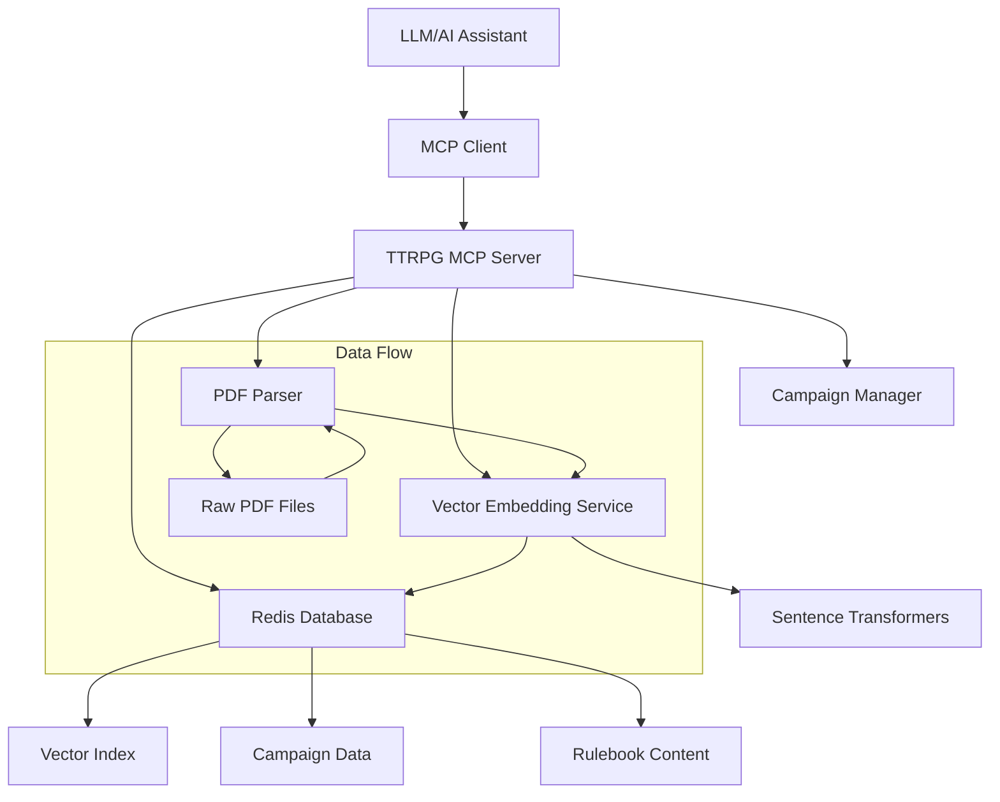

# Design Document

## Overview

The TTRPG Assistant MCP tool is designed as a Model Context Protocol server that provides LLMs with access to parsed TTRPG rulebook content and campaign management capabilities. The system uses Redis as both a vector database for semantic search and a traditional data store for campaign information. The architecture emphasizes simplicity, performance, and accessibility for non-technical users while providing powerful search capabilities for game masters and players.

## Architecture

### High-Level Architecture



### Component Architecture

The system follows a modular design with clear separation of concerns:

1. **MCP Server Layer**: Handles protocol communication and request routing
2. **Service Layer**: Business logic for search, parsing, and campaign management
3. **Data Layer**: Redis-based storage with vector and traditional data capabilities
4. **Processing Layer**: PDF parsing and embedding generation

## Components and Interfaces

### MCP Server Interface

The MCP server exposes the following tools to LLMs:

```python
# Tool definitions for MCP protocol
TOOLS = [
    {
        "name": "search_rulebook",
        "description": "Search TTRPG rulebooks for rules, spells, monsters, etc.",
        "inputSchema": {
            "type": "object",
            "properties": {
                "query": {"type": "string", "description": "Search query"},
                "rulebook": {"type": "string", "description": "Optional specific rulebook"},
                "content_type": {"type": "string", "enum": ["rule", "spell", "monster", "item", "any"]},
                "max_results": {"type": "integer", "default": 5}
            }
        }
    },
    {
        "name": "manage_campaign",
        "description": "Store, retrieve, or update campaign data",
        "inputSchema": {
            "type": "object", 
            "properties": {
                "action": {"type": "string", "enum": ["create", "read", "update", "delete", "list"]},
                "campaign_id": {"type": "string"},
                "data_type": {"type": "string", "enum": ["character", "npc", "location", "plot", "session"]},
                "data": {"type": "object", "description": "Campaign data payload"}
            }
        }
    },
    {
        "name": "add_rulebook",
        "description": "Process and add a new PDF rulebook to the system",
        "inputSchema": {
            "type": "object",
            "properties": {
                "pdf_path": {"type": "string", "description": "Path to PDF file"},
                "rulebook_name": {"type": "string", "description": "Display name for the rulebook"},
                "system": {"type": "string", "description": "Game system (D&D 5e, Pathfinder, etc.)"}
            }
        }
    }
]
```

### PDF Parser Component

```python
class PDFParser:
    """Handles extraction and structuring of PDF content"""
    
    def extract_text(self, pdf_path: str) -> Dict[str, Any]:
        """Extract text while preserving structure"""
        pass
    
    def identify_sections(self, text: str, toc_data: List[str]) -> List[Section]:
        """Use table of contents to identify logical sections"""
        pass
    
    def extract_tables(self, pdf_path: str) -> List[Table]:
        """Extract tabular data with structure preservation"""
        pass
    
    def create_chunks(self, sections: List[Section]) -> List[ContentChunk]:
        """Create searchable chunks with metadata"""
        pass
```

### Vector Embedding Service

```python
class EmbeddingService:
    """Manages text-to-vector conversion and similarity search"""
    
    def __init__(self, model_name: str = "all-MiniLM-L6-v2"):
        self.model = SentenceTransformer(model_name)
    
    def generate_embedding(self, text: str) -> List[float]:
        """Convert text to vector embedding"""
        pass
    
    def batch_embed(self, texts: List[str]) -> List[List[float]]:
        """Efficiently process multiple texts"""
        pass
```

### Redis Data Manager

```python
class RedisDataManager:
    """Handles all Redis operations for both vector and traditional data"""
    
    def setup_vector_index(self, index_name: str, schema: Dict) -> None:
        """Create vector search index"""
        pass
    
    def store_rulebook_content(self, content: List[ContentChunk]) -> None:
        """Store parsed rulebook with embeddings"""
        pass
    
    def vector_search(self, query_embedding: List[float], filters: Dict = None) -> List[SearchResult]:
        """Perform semantic search"""
        pass
    
    def store_campaign_data(self, campaign_id: str, data_type: str, data: Dict) -> str:
        """Store campaign information"""
        pass
    
    def get_campaign_data(self, campaign_id: str, data_type: str = None) -> List[Dict]:
        """Retrieve campaign information"""
        pass
```

## Data Models

### Content Chunk Model

```python
@dataclass
class ContentChunk:
    id: str
    rulebook: str
    system: str  # D&D 5e, Pathfinder, etc.
    content_type: str  # rule, spell, monster, item
    title: str
    content: str
    page_number: int
    section_path: List[str]  # ["Chapter 1", "Combat", "Attack Rolls"]
    embedding: List[float]
    metadata: Dict[str, Any]
    tables: List[Table] = None
```

### Campaign Data Model

```python
@dataclass
class CampaignData:
    id: str
    campaign_id: str
    data_type: str
    name: str
    content: Dict[str, Any]
    created_at: datetime
    updated_at: datetime
    version: int
    tags: List[str] = None
```

### Search Result Model

```python
@dataclass
class SearchResult:
    content_chunk: ContentChunk
    relevance_score: float
    match_type: str  # "semantic", "keyword", "exact"
    highlighted_text: str = None
```

## Error Handling

### PDF Processing Errors

- **Corrupted PDF**: Graceful failure with clear error message
- **Password-protected PDF**: Prompt for password or skip with warning
- **Large file handling**: Progress tracking and memory management
- **OCR failures**: Fallback to alternative extraction methods

### Redis Connection Errors

- **Connection failures**: Retry logic with exponential backoff
- **Memory limits**: Chunked processing for large datasets
- **Index corruption**: Automatic rebuild capabilities
- **Query timeouts**: Configurable timeout with partial results

### MCP Protocol Errors

- **Invalid tool calls**: Structured error responses with suggestions
- **Authentication failures**: Clear error messages for setup issues
- **Rate limiting**: Graceful degradation and queuing

## Testing Strategy

### Unit Testing

- **PDF Parser**: Test with various PDF formats and structures
- **Embedding Service**: Verify embedding consistency and similarity calculations
- **Redis Operations**: Mock Redis for fast, isolated tests
- **MCP Protocol**: Test tool registration and request/response handling

### Integration Testing

- **End-to-end search**: Real PDF processing through to search results
- **Campaign data workflows**: Full CRUD operations with Redis
- **MCP client integration**: Test with actual MCP client implementations
- **Performance testing**: Large rulebook processing and concurrent queries

### Test Data

- **Sample PDFs**: Curated set of TTRPG PDFs with known content
- **Campaign scenarios**: Realistic campaign data for testing
- **Edge cases**: Malformed PDFs, unusual table structures, large files

### Performance Benchmarks

- **Search latency**: Target <2 seconds for typical queries
- **Memory usage**: Monitor during large PDF processing
- **Concurrent users**: Test with multiple simultaneous queries
- **Storage efficiency**: Vector embedding compression and indexing

## Configuration and Deployment

### Configuration Options

```yaml
# config.yaml
redis:
  host: localhost
  port: 6379
  db: 0
  password: null

embedding:
  model: "all-MiniLM-L6-v2"
  batch_size: 32
  cache_embeddings: true

pdf_processing:
  max_file_size_mb: 100
  ocr_enabled: true
  preserve_formatting: true

search:
  default_max_results: 5
  similarity_threshold: 0.7
  enable_keyword_fallback: true

mcp:
  server_name: "ttrpg-assistant"
  version: "1.0.0"
```

### Deployment Considerations

- **Redis setup**: Instructions for local and cloud Redis instances
- **Model downloads**: Automatic downloading of embedding models
- **File permissions**: PDF access and temporary file handling
- **Resource requirements**: Memory and CPU recommendations
- **Scaling**: Horizontal scaling considerations for multiple users