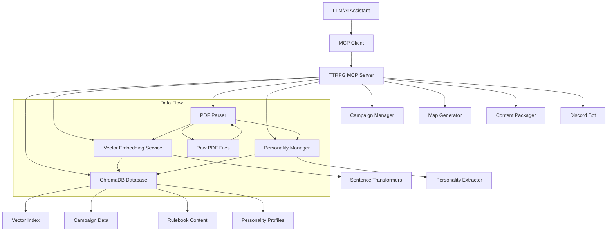

# Design Document

## Overview

The TTRPG Assistant MCP tool is designed as a Model Context Protocol server that provides LLMs with access to parsed TTRPG rulebook content and campaign management capabilities. The system uses Redis as both a vector database for semantic search and a traditional data store for campaign information. The architecture emphasizes simplicity, performance, and accessibility for non-technical users while providing powerful search capabilities for game masters and players.

## Architecture

### High-Level Architecture



### Component Architecture

The system follows a modular design with clear separation of concerns:

1.  **MCP Server Layer**: Handles protocol communication and request routing
2.  **Service Layer**: Business logic for search, parsing, and campaign management
3.  **Data Layer**: ChromaDB-based storage with vector and traditional data capabilities
4.  **Processing Layer**: PDF parsing and embedding generation
5.  **Personality Layer**: Extracts and manages RPG system personalities and vernacular
6.  **Web UI Layer**: A user-friendly web interface for interacting with the system.
7.  **CLI Layer**: A command-line interface for interacting with the system.
8.  **Map Generation Layer**: Generates simple SVG maps for combat encounters.
9.  **Content Packager Layer**: Creates and loads content packs.
10.  **Discord Bot Layer**: Integrates the TTRPG Assistant with Discord.

## Components and Interfaces

### MCP Server Interface

The MCP server exposes the following tools to LLMs:

```python
# Tool definitions for MCP protocol
TOOLS = [
    {
        "name": "search",
        "description": "Search TTRPG source material for rules, lore, etc.",
        "inputSchema": {
            "type": "object",
            "properties": {
                "query": {"type": "string", "description": "Search query"},
                "rulebook": {"type": "string", "description": "Optional specific source"},
                "source_type": {"type": "string", "enum": ["rulebook", "flavor"]},
                "content_type": {"type": "string", "enum": ["rule", "spell", "monster", "item", "text", "any"]},
                "max_results": {"type": "integer", "default": 5}
            }
        }
    },
    {
        "name": "manage_campaign",
        "description": "Store, retrieve, or update campaign data",
        "inputSchema": {
            "type": "object", 
            "properties": {
                "action": {"type": "string", "enum": ["create", "read", "update", "delete", "list", "export", "import"]},
                "campaign_id": {"type": "string"},
                "data_type": {"type": "string", "enum": ["character", "npc", "location", "plot", "session"]},
                "data": {"type": "object", "description": "Campaign data payload"}
            }
        }
    },
    {
        "name": "add_source",
        "description": "Process and add a new PDF source to the system",
        "inputSchema": {
            "type": "object",
            "properties": {
                "pdf_path": {"type": "string", "description": "Path to PDF file"},
                "rulebook_name": {"type": "string", "description": "Display name for the source"},
                "system": {"type": "string", "description": "Game system (D&D 5e, Pathfinder, etc.)"},
                "source_type": {"type": "string", "enum": ["rulebook", "flavor"]}
            }
        }
    },
    {
        "name": "get_rulebook_personality",
        "description": "Get the personality for a rulebook",
        "inputSchema": {
            "type": "object",
            "properties": {
                "rulebook_name": {"type": "string", "description": "The name of the rulebook"}
            }
        }
    },
    {
        "name": "get_character_creation_rules",
        "description": "Get the character creation rules for a rulebook",
        "inputSchema": {
            "type": "object",
            "properties": {
                "rulebook_name": {"type": "string", "description": "The name of the rulebook"}
            }
        }
    },
    {
        "name": "generate_backstory",
        "description": "Generate a backstory for a character",
        "inputSchema": {
            "type": "object",
            "properties": {
                "rulebook_name": {"type": "string", "description": "The name of the rulebook"},
                "character_details": {"type": "object", "description": "The character's details"},
                "player_params": {"type": "string", "description": "Any additional parameters from the player"},
                "flavor_sources": {"type": "array", "items": {"type": "string"}}
            }
        }
    },
    {
        "name": "generate_npc",
        "description": "Generate an NPC",
        "inputSchema": {
            "type": "object",
            "properties": {
                "rulebook_name": {"type": "string", "description": "The name of the rulebook"},
                "player_level": {"type": "integer", "description": "The average level of the player characters"},
                "npc_description": {"type": "string", "description": "A brief description of the NPC"},
                "flavor_sources": {"type": "array", "items": {"type": "string"}}
            }
        }
    },
    {
        "name": "manage_session",
        "description": "Manage a game session",
        "inputSchema": {
            "type": "object",
            "properties": {
                "action": {"type": "string", "enum": ["start", "add_note", "set_initiative", "add_monster", "update_monster_hp", "get"]},
                "campaign_id": {"type": "string"},
                "session_id": {"type": "string"},
                "data": {"type": "object", "description": "The data for the action"}
            }
        }
    },
    {
        "name": "generate_map",
        "description": "Generate a map for a combat encounter",
        "inputSchema": {
            "type": "object",
            "properties": {
                "rulebook_name": {"type": "string", "description": "The name of the rulebook"},
                "map_description": {"type": "string", "description": "A brief description of the map"},
                "width": {"type": "integer", "default": 20},
                "height": {"type": "integer", "default": 20}
            }
        }
    },
    {
        "name": "create_content_pack",
        "description": "Create a content pack from a source",
        "inputSchema": {
            "type": "object",
            "properties": {
                "source_name": {"type": "string", "description": "The name of the source to pack"},
                "output_path": {"type": "string", "description": "The path to save the content pack"}
            }
        }
    },
    {
        "name": "install_content_pack",
        "description": "Install a content pack",
        "inputSchema": {
            "type": "object",
            "properties": {
                "pack_path": {"type": "string", "description": "The path to the content pack"}
            }
        }
    },
    {
        "name": "quick_search",
        "description": "Quick search for simple lookups without extensive processing",
        "inputSchema": {
            "type": "object",
            "properties": {
                "query": {"type": "string", "description": "Search query"},
                "max_results": {"type": "integer", "default": 3}
            }
        }
    },
    {
        "name": "suggest_completions",
        "description": "Get query completion suggestions based on vocabulary",
        "inputSchema": {
            "type": "object",
            "properties": {
                "partial_query": {"type": "string", "description": "Partial query to complete"},
                "limit": {"type": "integer", "default": 5}
            }
        }
    },
    {
        "name": "explain_search",
        "description": "Get detailed explanation of search results and relevance factors",
        "inputSchema": {
            "type": "object",
            "properties": {
                "query": {"type": "string", "description": "Query to explain"}
            }
        }
    },
    {
        "name": "get_search_stats",
        "description": "Get statistics about the search service",
        "inputSchema": {
            "type": "object",
            "properties": {},
            "required": []
        }
    },
    {
        "name": "manage_personality",
        "description": "Manage RPG personality profiles and vernacular",
        "inputSchema": {
            "type": "object",
            "properties": {
                "action": {
                    "type": "string",
                    "enum": ["get", "list", "summary", "vernacular", "compare", "stats"],
                    "description": "Action to perform"
                },
                "system_name": {
                    "type": "string",
                    "description": "RPG system name"
                },
                "systems": {
                    "type": "array",
                    "items": {"type": "string"},
                    "description": "List of systems for comparison"
                }
            },
            "required": ["action"]
        }
    }
]
```

### PDF Parser Component

```python
class PDFParser:
    """Handles extraction and structuring of PDF content"""
    
    def extract_text(self, pdf_path: str) -> Dict[str, Any]:
        """Extract text while preserving structure"""
        pass
    
    def extract_personality_text(self, pdf_path: str, num_pages: int = 5) -> str:
        """Extracts text from the first few pages to determine personality."""
        pass

    def identify_sections(self, text: str, toc_data: List[str]) -> List[Section]:
        """Use table of contents to identify logical sections"""
        pass
    
    def create_chunks(self, sections: List[Section]) -> List[ContentChunk]:
        """Create searchable chunks with metadata"""
        pass
```

### Redis Data Manager

```python
class RedisDataManager:
    """Handles all Redis operations for both vector and traditional data"""
    
    def setup_vector_index(self, index_name: str, schema: Dict) -> None:
        """Create vector search index"""
        pass
    
    def store_rulebook_content(self, content: List[ContentChunk]) -> None:
        """Store parsed rulebook with embeddings"""
        pass

    def store_rulebook_personality(self, rulebook_name: str, personality_text: str) -> None:
        """Stores the personality text for a rulebook (deprecated - use PersonalityManager)."""
        pass

    def get_rulebook_personality(self, rulebook_name: str) -> str:
        """Retrieves the personality text for a rulebook (deprecated - use PersonalityManager)."""
        pass
    
    def vector_search(self, query_embedding: List[float], filters: Dict = None) -> List[SearchResult]:
        """Perform semantic search"""
        pass
    
    def store_campaign_data(self, campaign_id: str, data_type: str, data: Dict) -> str:
        """Store campaign information"""
        pass
    
    def get_campaign_data(self, campaign_id: str, data_type: str = None) -> List[Dict]:
        """Retrieve campaign information"""
        pass

    def export_campaign_data(self, campaign_id: str) -> Dict[str, Any]:
        """Export all data for a campaign"""
        pass

    def import_campaign_data(self, campaign_id: str, data: Dict[str, Any]) -> None:
        """Import campaign data"""
        pass
```

### Personality Service Component

```python
class PersonalityManager:
    """Manages personality profiles and vernacular for RPG systems"""
    
    def __init__(self, data_manager: ChromaDataManager):
        self.data_manager = data_manager
        self.extractor = PersonalityExtractor()
    
    def extract_and_store_personality(self, chunks: List[ContentChunk], system_name: str) -> Optional[RPGPersonality]:
        """Extract personality from chunks and store it"""
        pass
    
    def get_personality(self, system_name: str) -> Optional[RPGPersonality]:
        """Get personality profile for a system"""
        pass
    
    def get_personality_summary(self, system_name: str) -> Optional[Dict[str, Any]]:
        """Get a summary of personality data for a system"""
        pass
    
    def list_personalities(self) -> List[str]:
        """List all available personality systems"""
        pass
    
    def get_vernacular_for_system(self, system_name: str) -> List[Dict[str, Any]]:
        """Get vernacular terms for a system"""
        pass
    
    def generate_personality_prompt(self, system_name: str, query: str, context: str = "") -> Optional[PersonalityPrompt]:
        """Generate a personality-aware prompt for a system"""
        pass
    
    def create_personality_comparison(self, systems: List[str]) -> Dict[str, Any]:
        """Create a comparison between personality systems"""
        pass

class PersonalityExtractor:
    """Extracts personality traits and vernacular from rulebook content"""
    
    def extract_personality(self, chunks: List[ContentChunk], system_name: str) -> RPGPersonality:
        """Extract personality profile from rulebook content"""
        pass
    
    def generate_personality_prompt(self, personality: RPGPersonality, query: str, context: str = "") -> PersonalityPrompt:
        """Generate a personality-aware prompt"""
        pass
```

## Data Models

### Content Chunk Model

```python
@dataclass
class ContentChunk:
    id: str
    rulebook: str
    system: str
    source_type: str # "rulebook" or "flavor"
    content_type: str
    title: str
    content: str
    page_number: int
    section_path: List[str]
    embedding: List[float]
    metadata: Dict[str, Any]
```

### Campaign Data Model

```python
@dataclass
class CampaignData:
    id: str
    campaign_id: str
    data_type: str
    name: str
    content: Dict[str, Any]
    created_at: datetime
    updated_at: datetime
    version: int
    tags: List[str] = None
```

### Search Result Model

```python
@dataclass
class SearchResult:
    content_chunk: ContentChunk
    relevance_score: float
    match_type: str
    highlighted_text: str = None
```

### Session Data Model

```python
@dataclass
class InitiativeEntry:
    name: str
    initiative: int

@dataclass
class MonsterState:
    name: str
    max_hp: int
    current_hp: int

@dataclass
class SessionData(CampaignData):
    notes: List[str] = None
    initiative_order: List[InitiativeEntry] = None
    monsters: List[MonsterState] = None
```

### Personality Data Models

```python
@dataclass
class VernacularPattern:
    """Represents a vernacular or speech pattern found in a rulebook"""
    term: str
    definition: str
    context: str
    frequency: int
    examples: List[str]
    category: str  # "neologism", "archaic", "technical", "slang", "formal", "magical", "mechanical"

@dataclass
class PersonalityTrait:
    """Represents a personality trait extracted from writing style"""
    trait_name: str
    description: str
    evidence_text: List[str]
    confidence: float
    examples: List[str]

@dataclass
class RPGPersonality:
    """Represents the personality profile for an RPG system"""
    system_name: str
    personality_name: str
    description: str
    tone: str  # "formal", "casual", "mysterious", "authoritative", "whimsical"
    perspective: str  # "omniscient", "scholarly", "conspiratorial", "practical"
    formality_level: str  # "high", "medium", "low"
    vernacular_patterns: List[VernacularPattern]
    personality_traits: List[PersonalityTrait]
    preferred_structure: str  # "academic", "narrative", "bullet_points", "conversational"
    example_phrases: List[str]
    avoid_phrases: List[str]
    system_context: str  # Background information about the RPG setting
    response_style: str  # How to format responses
    extracted_from: List[str]  # Source rulebooks
    created_at: datetime
    confidence_score: float

@dataclass
class PersonalityPrompt:
    """Represents a personality-aware prompt template"""
    system_name: str
    base_prompt: str
    personality_instructions: str
    example_responses: List[str]
    vernacular_instructions: str
```

## Error Handling

### PDF Processing Errors

- **Corrupted PDF**: Graceful failure with clear error message
- **Password-protected PDF**: Prompt for password or skip with warning
- **Large file handling**: Progress tracking and memory management
- **OCR failures**: Fallback to alternative extraction methods

### Redis Connection Errors

- **Connection failures**: Retry logic with exponential backoff
- **Memory limits**: Chunked processing for large datasets
- **Index corruption**: Automatic rebuild capabilities
- **Query timeouts**: Configurable timeout with partial results

### MCP Protocol Errors

- **Invalid tool calls**: Structured error responses with suggestions
- **Authentication failures**: Clear error messages for setup issues
- **Rate limiting**: Graceful degradation and queuing

## Testing Strategy

### Unit Testing

- **PDF Parser**: Test with various PDF formats and structures
- **Embedding Service**: Verify embedding consistency and similarity calculations
- **Redis Operations**: Mock Redis for fast, isolated tests
- **MCP Protocol**: Test tool registration and request/response handling
- **Map Generator**: Test the generation of SVG maps
- **Content Packager**: Test the creation and loading of content packs
- **Discord Bot**: Test the bot's commands

### Integration Testing

- **End-to-end search**: Real PDF processing through to search results
- **Campaign data workflows**: Full CRUD operations with Redis
- **MCP client integration**: Test with actual MCP client implementations
- **Performance testing**: Large rulebook processing and concurrent queries

### Test Data

- **Sample PDFs**: Curated set of TTRPG PDFs with known content
- **Campaign scenarios**: Realistic campaign data for testing
- **Edge cases**: Malformed PDFs, unusual table structures, large files

### Performance Benchmarks

- **Search latency**: Target <2 seconds for typical queries
- **Memory usage**: Monitor during large PDF processing
- **Concurrent users**: Test with multiple simultaneous queries
- **Storage efficiency**: Vector embedding compression and indexing

## Configuration and Deployment

### Configuration Options

```yaml
# config.yaml
redis:
  host: localhost
  port: 6379
  db: 0
  password: null

embedding:
  model: "all-MiniLM-L6-v2"
  batch_size: 32
  cache_embeddings: true

pdf_processing:
  max_file_size_mb: 100
  ocr_enabled: true
  preserve_formatting: true

search:
  default_max_results: 5
  similarity_threshold: 0.7
  enable_keyword_fallback: true

mcp:
  server_name: "ttrpg-assistant"
  version: "1.0.0"

discord:
  token: "YOUR_DISCORD_BOT_TOKEN"
```

### Deployment Considerations

- **Redis setup**: Instructions for local and cloud Redis instances
- **Model downloads**: Automatic downloading of embedding models
- **File permissions**: PDF access and temporary file handling
- **Resource requirements**: Memory and CPU recommendations
- **Scaling**: Horizontal scaling considerations for multiple users
- **Containerization**: Docker and Docker Compose files are provided for easy deployment.
- **CI/CD**: A GitHub Actions workflow is included for automated testing.
